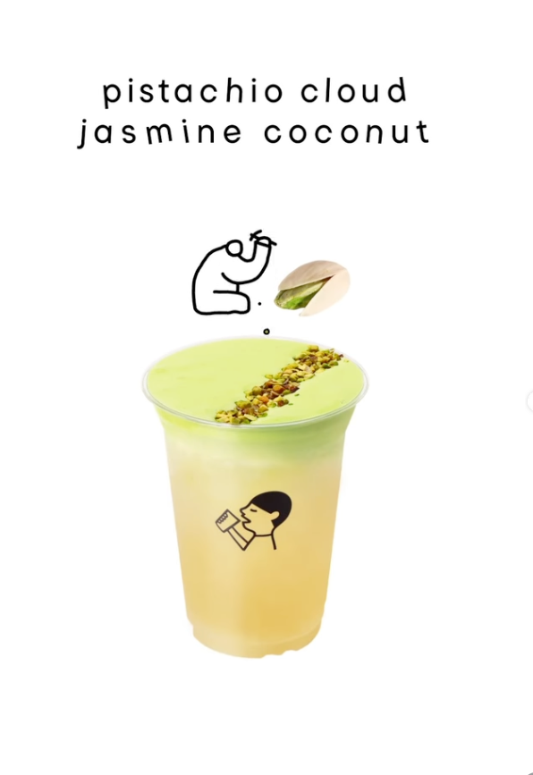
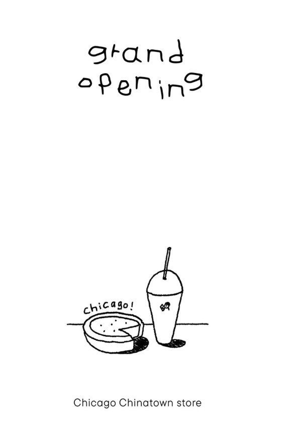
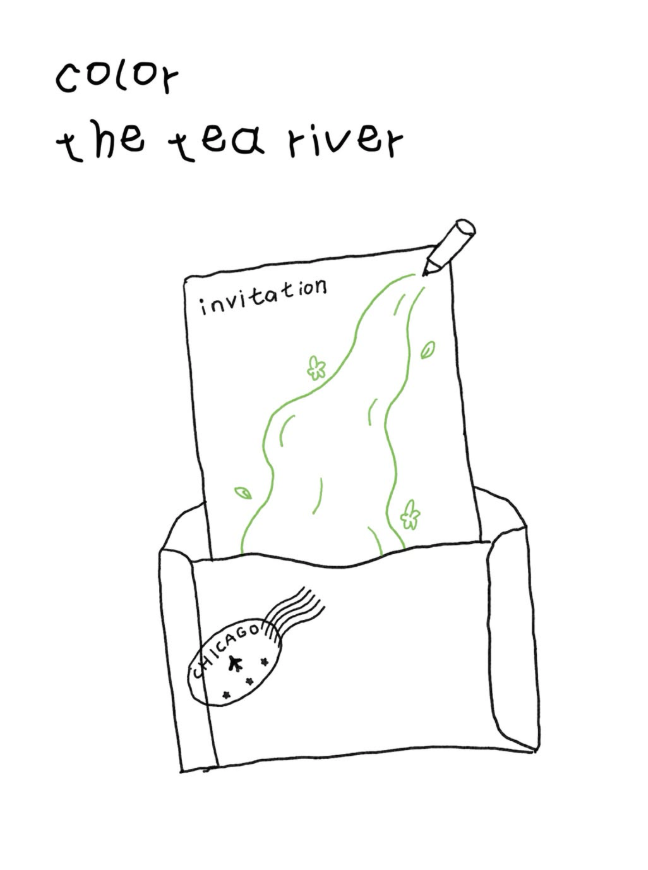

[TOC]

# 婚礼电子请柬

## 开发

### 技术栈

支持平台：微信小程序（主要）、移动和桌面web

前端：使用Taro（使用React + TypeScript + pnpm管理包），自由选择你认为最合适的动效库。默认字体：think-black。地图组件使用腾讯地图API，地点marker设置在成都慕上OnTheMoon。整个应用需要随时有一个背景音乐（our-love.mp3），该音乐在用户进入应用则开始循环播放。

后端：使用 Cloudflare（Workers + D1 + R2 CDN；可选腾讯云短信），配置位于 `infra/cloudflare/`

### 开发原则

1. 对于第三方框架和工具，必须上网搜索其最新的开发者文档后才能开始进行具体代码的编写。
2. 保证代码结构清晰，低耦合高内聚。
3. 确保重要组件可复用（e.g. 字体、图片）
4. 正确设置gitignore
5. 存放字体和多媒体于正确的文件位置

### 设计风格

极简线条风格。**“涂鸦风格” (Doodle Style)** 或 **“手绘插画风格” (Hand-drawn Illustration Style)**，并结合**极简主义 (Minimalism)** 。配合和谐且有趣的动效。页面与页面之间采用Scrollytelling以实现丝滑且自然的页面间切换。

设计风格参考：

## 主要页面顺序以及内容

### 第一页 - 首页

> 使用字体：thin-black

新郎 & 新娘
刘兆薰 & 高文珩

2026年7月25日 · 礼拜六 · 成都

诚挚邀请您见证我们的婚礼【使用字体：hand-writing-bold】

我们期待
于我们意义非凡的您
能够莅临现场

### 第二页 - 一个标题页

我们的故事【使用字体：bordered】

### 第三页

> 使用字体：childhood

2001年，同一个医生，接生了两个注定相遇的灵魂。

**01月06日** 新郎降临

**06月19日** 新娘出生

### 第四页

2001年 - 2019年

从懵懂孩提到并肩成长，命运的轨迹早已悄然重合，最好的朋友，也是彼此青春的见证者。

### 第五页

2019年7月25日

故事的转角，我们正式确定了彼此的心意。从青梅竹马到一生伴侣，我们的故事，由此写下新的篇章。

### 第六页

2019年 - 2023年

我们跨越了时差与国界。

从2020年西雅图的第一场的雪，到2021年的短暂团聚，再到2022年的久别重逢。 

这些跨越距离的时光，让我们更确信，并肩前行才是最好的选择。

### 第七页

2023年10月14日

抵达多伦多。

我们的坐标，从此永远重合。

### 第八页

2023 - 2026

在硕士学业与职场生活中，我们学会了分担与陪伴。 

家里还有一只名叫“宝宝”的小猫，是我们在这个城市里最暖的陪伴，也让我们的生活因为彼此而变得圆满。

### 第九页

七年，在这个充满随机性的世界，我们的轨迹始终指向彼此。

当所有的经纬度最终重合，便成为里程碑。

2026年7月25日，我们共同铭刻。

### 第十页

当日安排

15:00 宾客入席
扉启迎宾，静候光临【使用字体：hand-writing-thin】

您可以以这个时间点规划抵达时间，于入口处签到后我们会有专人引导您进入会场。

17:00 典礼开始
花门轻启，盟誓此夕【使用字体：hand-writing-thin】

婚礼仪式将于教堂内开始。我们没有着装要求，请您以舒适度为主安排服饰。

18:30 喜宴开始
佳肴盈席，共叙情谊【使用字体：hand-writing-thin】

请您在该电子请柬最后一页告知我们您的特殊饮食需求，比如食物过敏等。典礼结束后会有专人引导您入座。

20:00 欢聚时光
欢聚尽兴，杯盏余音【使用字体：hand-writing-thin】

在晚宴结束后，我们准备了餐后甜点和酒水供您消遣，让这一天在轻松愉悦中画上完美的句号。

### 第十一页

婚礼地点

成都 · 慕上

【地图组件】

若您自驾出行，请告知我们，我们会提前为您准备车位。

若您希望我们提供接驳服务，请在下一页表单中填写。

### 第十二页

宾客表单

主联系人：【中文字符串】

主联系人手机号：【必填】

同行赴宴人员：【可添加/删除的列表：一行两个input：姓名，与主联系人关系】

饮食忌口：【可选】

是否自驾：boolean【disable if 接驳服务 is true】

是否需要接驳服务：boolean【disable if 自驾 is true】

接驳地点：【only visible when 接驳 is true】

您还希望我们知道什么？【text field】